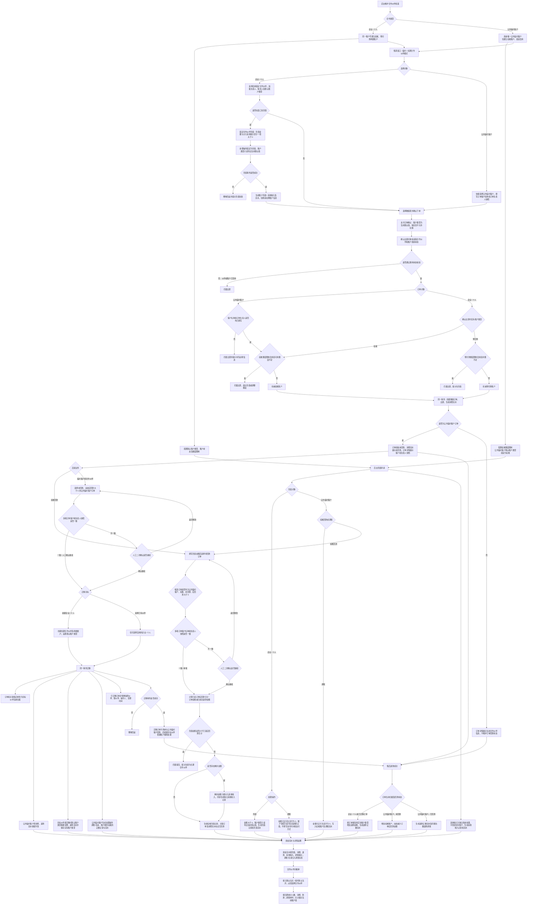

# PRD｜V3.2 散客合作伙伴管理-20260805

## 1. 文档信息

| 项目 | 内容 |
| --- | --- |
| 产品 | 程程票票务系统 |
| 版本 | V3.2 散客合作伙伴管理-20260805 |
| 文档状态 | 已确认规则汇总；后台原型已覆盖合作伙伴、账户、充值、资金流水、临时客户转合作伙伴、订单详情及合作伙伴对帐单样例 |
| 覆盖端 | PC 后台、售票窗口 |
| 本期目标 | 建立可正可负的合作伙伴双账户模型，统一充值、退款、流水与公共临时客户回款处理口径。 |

## 2. 需求背景与目标

当前散客挂帐仅记录支付方式和金额，无法识别具体挂帐对象、对接负责人及后续账户资金变化。系统需为散客企业、个人及公共临时客户建立合作伙伴档案和账户基础数据，形成挂帐、预付款、充值、资金流水、售票窗口与订单的可追溯闭环。

合作伙伴的挂帐和预付款账户均可出现正数、0 或负数，以承接客户先消费后回款、先充值后消费及余额不足后继续记账等实际业务。账户类型决定资金归属和财务凭证，金额正负仅表示账户增加或扣减。

### 2.1 核心原则

1. 企业、个人合作伙伴共用一个对外账户号，账户下同时建立挂帐、预付款两个账户类型；两个账户类型的余额均允许正数、0、负数。
2. **账户类型决定财务凭证与资金归属；金额正负仅表示该账户增加或扣减，不再用于判断挂帐或预付款性质。**
3. 消费为账户扣减（负数）；退款为账户增加（正数）。
4. 挂帐、预付款的正常充值为账户增加；调账可正可负；其他收入只能为正数且不影响任何账户。
5. 合作伙伴的“默认账户类型”决定充值、消费、退款等业务当前使用挂帐还是预付款；业务记录保存实际账户类型，默认账户类型后续变更不回写历史记录。
6. 企业、个人合作伙伴不再做“待回款订单平账”；公共临时客户仍保留按订单回款的特殊处理。

## 3. 产品入口与菜单规划

### 3.1 PC 后台

```text
合作伙伴管理
├─ 合作伙伴管理
├─ 合作伙伴账户管理
│  ├─ 挂帐管理
│  └─ 预付款管理
├─ 充值申请
│  ├─ 账户充值
│  └─ 其他收入
└─ 资金流水
   ├─ 全部
   ├─ 充值
   ├─ 消费
   ├─ 退款
   ├─ 其他收入
   └─ 调账

报表中心
└─ 合作伙伴对帐单
```

### 3.2 售票窗口与订单

```text
售票窗口
└─ 售票
   ├─ 散客票
   ├─ 团队票
   ├─ 临时/长期合作伙伴
   └─ 挂单列表

售票窗口顶部菜单
└─ 合作伙伴（统计后、内导前）
   ├─ 合作伙伴充值
   ├─ 账户充值记录
   ├─ 其他收入记录
   └─ 充值报表

后台订单中心
└─ 散客订单管理
   └─ 散客订单详情（按订单归属展示合作伙伴信息；已迁移订单增加合作伙伴变更记录）
```

“临时/长期合作伙伴”是售票窗口中的售票模式，不归入后台合作伙伴管理菜单；该模式不支持挂单操作。

### 3.3 本期原型与页面覆盖范围

- 后台管理端：合作伙伴管理、合作伙伴账户管理（挂帐管理、预付款管理）、充值申请（账户充值、其他收入）、资金流水、报表中心“合作伙伴对帐单”，以及相关新增、编辑、查看、额度记录、导入、详情和跳转交互。
- 售票窗口端：临时/长期合作伙伴售票页、选择合作伙伴、公共临时客户快捷选择、固定合作伙伴充值、支付订单确认和出票校验；顶部“合作伙伴”工作区的合作伙伴充值、账户充值记录、其他收入记录、充值报表。
- 后台订单端：散客订单详情按订单归属展示合作伙伴信息；公共临时客户挂帐订单额外展示订单回款状态，已迁移订单增加合作伙伴变更记录。
- 报表中心仅包含“合作伙伴对帐单”；详细指标、筛选项、统计口径和页面方案见 10.4。

原型入口（均为相对路径，文档上传服务器后可直接使用）：[原型中心](prototype-center.html)、[后台管理原型](prototype/index.html#/partner)、[合作伙伴变更订单详情](prototype/partner-order-change.html)、[后台合作伙伴对帐单](prototype/partner-statement.html)、[售票窗口原型](prototype/ticket-window.html)、[售票窗口合作伙伴页](prototype/partner-workspace.html)。

### 3.4 总体业务流程图


业务全流程概览，点击缩略图可放大查看；详细的全功能流程图及 Mermaid 源码见完整需求页中的“开发辅助：全功能流程图”。



已迁移订单仅在散客订单详情的“合作伙伴信息”下展示变更记录。

## 4. 核心对象与数据口径

### 4.1 合作类型

| 合作类型 | 定义 | 账户结构 |
| --- | --- | --- |
| 企业 | 固定合作伙伴 | 同一账户号下建立挂帐、预付款两个账户类型 |
| 个人 | 固定合作伙伴 | 同一账户号下建立挂帐、预付款两个账户类型 |
| 临时客户 | 系统唯一的公共临时客户，名称固定为“公共临时客户” | 仅建立挂帐账户类型 |

### 4.2 账户结构

| 对象 | 挂帐账户 | 预付款账户 | 默认账户类型 |
| --- | --- | --- | --- |
| 企业、个人 | 自动创建，可正可负 | 自动创建，可正可负 | 配置为“挂帐”或“预付款” |
| 公共临时客户 | 自动创建，可正可负 | 不创建 | 固定为“挂帐” |

- 账户号由系统生成；新增前显示“—”，创建成功后展示真实账户号且不可修改。
- 企业、个人创建后即同时存在挂帐、预付款两个账户类型；切换默认账户类型不新增、删除、合并或转移账户数据。
- 公共临时客户为共享账户，账户汇总仅展示账户金额，**不展示订单的已回款状态**。

### 4.3 固定合作伙伴与公共临时客户的使用边界

以下场景建立企业或个人固定合作伙伴：长期合作企业、长期合作个人、多次到访或多次消费客户，以及一次性支付金额较大、当次未消费完且需要保留余额供后续消费的客户。

- 固定合作伙伴同时拥有挂帐和预付款两个账户类型；具体由默认账户类型决定新发生的充值、消费和退款使用哪个账户。
- 一次性、零散、暂时无法明确为固定合作伙伴的客户统一使用公共临时客户。
- 公共临时客户全系统仅一条挂帐账户汇总；订单平账依据具体订单明细控制，不能根据公共账户汇总金额判断回款上限或订单已回款状态。
- 存在余额留存或持续合作需求时，应通过“临时客户转合作伙伴”处理，不在公共临时客户账户中留存可供后续消费的余额。

### 4.4 账户金额方向

| 业务动作 | 挂帐账户 | 预付款账户 | 其他收入 |
| --- | --- | --- | --- |
| 消费 | 扣减，负数流水 | 扣减，负数流水 | 不产生 |
| 普通退款 | 增加，正数流水 | 增加，正数流水 | 不产生 |
| 挂帐充值 | 增加，充值金额必须大于 0 | 不适用 | 不适用 |
| 预付款充值 | 不适用 | 增加，充值金额必须大于 0 | 不适用 |
| 调账 | 当前配置账户增加或扣减 | 当前配置账户增加或扣减 | 不适用 |
| 其他收入充值 | 不影响账户 | 不影响账户 | 正数记录 |

### 4.5 额度限制

#### 挂帐

- 可配置挂帐额度与额度限制开关。
- 开启额度限制时，售票前校验可用挂帐额度；不足则不允许消费。
- 关闭额度限制时，不做挂帐额度拦截。
- 计算公式：`可用挂帐额度 = 挂帐额度 + 当前挂帐金额`。
  - 当前挂帐金额为 `-600.00`，挂帐额度为 `1000.00` 时，可用挂帐额度为 `400.00`。
  - 当前挂帐金额为 `100.00`，挂帐额度为 `1000.00` 时，可用挂帐额度为 `1100.00`。

#### 预付款

- 增加字段名称：**额度限制**。
- 开启额度限制时，预付款余额到 `0.00` 后不允许继续使用预付款支付。
- 关闭额度限制时，预付款允许扣减至负数。
- 预付款额度限制不配置数值额度。

## 5. 合作伙伴档案

### 5.1 列表页

#### 筛选条件

| 字段 | 展示方式 | 规则 |
| --- | --- | --- |
| 合作类型 | 下拉单选 | 企业、个人、临时客户 |
| 合作伙伴名称 | 文本输入 | 模糊搜索 |
| 默认账户类型 | 下拉单选 | 挂帐、预付款 |
| 对接负责人 | 文本输入 | 输入员工名或手机号，按已保存快照模糊搜索；不使用下拉选择 |
| 状态 | 下拉单选 | 启用、禁用 |

操作：查询、重置；新增、导出位于筛选区下方、表格上方并右对齐。

#### 列表字段

| 字段 | 规则 |
| --- | --- |
| 合作类型 | 企业、个人、临时客户 |
| 合作伙伴名称 | 全系统唯一；临时客户固定为“公共临时客户” |
| 账户号 | 系统生成 |
| 默认账户类型 | 挂帐或预付款；临时客户固定挂帐 |
| 联系人 | 临时客户显示“—” |
| 联系电话 | 临时客户显示“—” |
| 对接负责人 | 保存员工名和手机号快照；临时客户显示“—” |
| 状态 | 绿色圆点＋启用；橙色圆点＋禁用 |
| 更新人 | 最后一次新增或编辑操作的员工名 |
| 更新时间 | 创建或最后编辑时间 |
| 操作 | 查看、编辑、启用/禁用、账户、删除；单行展示 |

默认按更新时间倒序。

### 5.2 新增、查看、编辑

| 字段 | 企业、个人 | 公共临时客户 |
| --- | --- | --- |
| 合作类型 | 必填：企业/个人 | 临时客户 |
| 合作伙伴名称 | 必填、全系统唯一 | 固定“公共临时客户”，不可填写 |
| 联系人 | 必填；最多 15 个字符，保存前去除首尾空格 | 不展示 |
| 联系电话 | 必填；最多 15 个字符，保存前去除首尾空格；支持手机号、座机号及短横线 | 不展示 |
| 对接负责人 | 选择启用员工；按姓名或手机号模糊搜索 | 不展示 |
| 默认账户类型 | 必填：挂帐/预付款 | 固定挂帐，不可修改 |
| 状态 | 新增默认启用 | 固定启用；创建时不展示状态字段，保存成功后生成启用的公共临时客户 |
| 账户号 | 新增显示“—”；创建成功后只读 | 新增显示“—”；创建成功后只读 |
| 备注 | 最多 500 字 | 最多 500 字 |

#### 表单承载与字段校验

- 新增、查看、编辑均使用票务系统轻量维护规范的 `600px` 弹窗，字段顺序保持一致。
- 查看页全部只读，底部仅“关闭”；编辑页合作类型、账户号只读，其余字段按本节权限编辑。
- 合作伙伴名称：企业、个人必填，最多 25 个字符；保存前去除首尾空格，去空后不能为空，并以去空后的名称校验全系统唯一。
  - 未填写：`请输入合作伙伴名称`
  - 超长：`合作伙伴名称最多输入25个字符`
  - 重复：`合作伙伴名称已存在，请重新输入`
- 联系人、联系电话：企业、个人必填，最多 15 个字符；保存前去除首尾空格。联系电话支持手机号、座机号及短横线。
- 临时客户：联系人、联系电话、对接负责人、默认账户类型、状态和账户号不展示、不填写；系统固定默认账户类型为挂帐、状态为启用。系统已经存在公共临时客户时，不允许再次创建。

#### 对接负责人

- 新增或变更时仅可选择**启用员工**。
- 支持按员工姓名或手机号模糊搜索。
- 保存字段包括员工 ID、员工名、手机号。页面仅展示员工名＋手机号快照；员工 ID 仅作后续数据关联备用，不用于实时回显当前员工资料。
- 负责人后续被禁用或信息变更时，历史信息与已有档案允许回显、保留；禁用员工不再出现在新增选择结果中，历史快照不回写。

#### 默认账户类型变更

| 变更方向 | 前置校验 | 不满足时提示 |
| --- | --- | --- |
| 挂帐 → 预付款 | 当前挂帐金额必须等于 `0.00` | 当前挂帐金额不为0，无法切换为预付款，请先通过调账处理为0后再操作。 |
| 预付款 → 挂帐 | 当前预付款余额必须等于 `0.00` | 当前预付款余额不为0，无法切换为挂帐，请先通过调账处理为0后再操作。 |

- 不因金额为正而放宽；只要源账户金额不为 `0.00` 即不允许切换。
- 不自动转移余额、不生成充值记录或资金流水、不影响历史订单。
- 保存后仅影响后续充值、消费、退款等业务实际使用的账户类型；历史记录仍展示业务发生时保存的账户类型。

#### 保存逻辑

1. 校验必填、长度、联系人与联系电话、负责人及默认账户类型规则。
2. 对文本字段去除首尾空格，并校验合作伙伴名称唯一性。
3. 类型为临时客户时，校验系统中不存在其他公共临时客户。
4. 创建时在同一业务事务中创建合作伙伴档案和账户；企业、个人在同一账户号下创建挂帐、预付款两个账户类型，临时客户只创建挂帐账户类型。
5. 任一步骤失败均不保留本次新增数据；成功后记录更新人和更新时间。
6. 编辑不修改账户号和既有挂帐、预付款账户结构；历史订单、充值和资金流水不因编辑回写。

### 5.3 操作规则

#### 查看

- 标题“查看合作伙伴”。
- 加载全部资料，字段只读；账户号展示真实值。
- 底部仅“关闭”。

#### 编辑

- 标题“编辑合作伙伴”。
- 合作类型、账户号只读。
- 其他字段按本节规则编辑；保存后更新更新人、更新时间，不重新生成账户或账户类型。

#### 启用/禁用

- 启用状态显示“禁用”；禁用状态显示“启用”。
- 禁用确认：`确认禁用该合作伙伴吗？禁用后，该合作伙伴将无法在售票窗口中选择。`
- 启用确认：`确认启用该合作伙伴吗？启用后，该合作伙伴可在售票窗口中选择。`
- 状态影响售票窗口是否可选择，不影响历史数据查询与已产生的资金记录。

#### 账户

- 跳转合作伙伴账户管理，携带账户号与当前账户类型。
- 目标页只加载该合作伙伴；打开所携带账户类型对应的挂帐/预付款标签，回填账户号并自动查询。

#### 删除

- 任一账户类型已经产生充值、消费或退款记录时不允许删除；余额恢复到 0 也不例外。
- 无任何资金记录时允许删除，删除档案与未产生业务的账户数据。
- 删除确认：`删除后无法恢复，确认删除该合作伙伴吗？`
- 不允许删除提示：`该合作伙伴账户已产生资金记录，不允许删除，可将合作伙伴设置为禁用。`

## 6. 合作伙伴账户管理

### 6.1 页面、标签与账户号

页面名称为“合作伙伴账户管理”，包含“挂帐管理、预付款管理”两个标签。

- 从左侧菜单进入时，默认打开挂帐管理并查询全部挂帐账户。
- 从合作伙伴列表点击“账户”进入时，携带账户号与账户类型，打开对应标签、回填账户号并自动查询。
- 每次切换标签均清空筛选条件并查询当前标签全部账户；用户可修改、清除或重置筛选条件。
- 标签参数缺失或无法识别时默认打开挂帐管理；账户号不存在或合作伙伴已删除时，保留账户号条件并显示暂无数据；在预付款管理查询临时客户账户号时显示暂无数据。
- 企业、个人的挂帐、预付款共用一个对外账户号，系统内部用“账户号＋账户类型”区分；临时客户只出现在挂帐管理。

### 6.2 挂帐管理

#### 筛选条件

| 合作类型 | 合作伙伴名称 | 账户号 | 状态 | 额度限制 | 挂帐金额区间 |
| --- | --- | --- | --- | --- | --- |
| 企业、个人、临时客户 | 模糊搜索 | 精确/模糊搜索 | 启用、禁用 | 启用、禁用 | 起止金额 |

#### 列表字段

| 合作类型 | 合作伙伴名称 | 账户号 | 挂帐金额 | 挂帐额度 | 可用挂帐额度 | 额度限制 | 状态 | 操作 |
| --- | --- | --- | --- | --- | --- | --- | --- |
| 企业/个人/临时客户 | 名称 | 系统账户号 | 可正可负 | 配置金额 | 挂帐额度＋当前挂帐金额 | 启用/禁用 | 启用/禁用 | 启用/禁用额度限制、调整额度、额度记录、充值记录、资金流水 |

#### 操作与页面按钮

- 行内操作：启用额度限制/禁用额度限制、调整额度、额度记录、充值记录、资金流水。
- 页面提供查询、重置、导出、配置列；查询、重置位于筛选区右侧，导出、配置列位于表格上方右侧。配置列复用系统公共能力，不在本方案描述内部逻辑。
- 默认按合作伙伴创建时间倒序。
- 状态、额度限制均使用“彩色圆点＋文字”：启用绿色、禁用橙色；状态来源于合作伙伴档案，不在账户页修改。

#### 挂帐金额与额度规则

- 挂帐金额可正、可负、可为 0，统一保留两位小数并使用千分位展示。
- 消费为挂帐账户扣减；退款、挂帐充值或调账按各自正负金额增加或扣减账户。
- 额度限制禁用时，不因额度不足拦截挂帐；未配置过额度时挂帐额度显示 `0.00`，曾配置过时保留原挂帐额度；可用挂帐额度显示“无限额”。
- 额度限制启用时，可用挂帐额度为 `max（挂帐额度 + 当前挂帐金额，0）`；挂帐额度必须大于 0，最多两位小数，不设业务最大值。
- 允许将额度调低至当前欠款绝对值以下：不改变既有欠款，可用额度显示 0，欠款回落到额度范围内前不允许新增挂帐。
- 禁用后保留原额度，重新启用默认沿用原配置；调整后额度与当前额度一致时不允许提交。

#### 启用、禁用与调整额度

“启用额度限制”和“调整额度”共用额度维护弹窗，展示：合作伙伴名称、账户号、当前挂帐金额、当前挂帐额度（均只读）、调整后挂帐额度（必填且大于 0）、调整原因（选填）。

- 调整额度直接生效，不需要审核，不属于充值申请，不产生资金流水；保存前二次确认。
- 调整后额度低于当前欠款时提示：`调整后的挂帐额度低于当前欠款金额，保存后该合作伙伴将暂时无法继续挂帐，确认调整吗？`
- 启用额度限制提示：`确认启用额度限制吗？启用后，合作伙伴可用挂帐额度将根据挂帐额度和当前挂帐金额计算。`
- 当前欠款超过拟启用额度时，追加：`当前欠款已超过挂帐额度，启用后该合作伙伴将暂时无法继续挂帐。`
- 禁用额度限制提示：`确认禁用额度限制吗？禁用后，该合作伙伴挂帐将不再受额度限制，请谨慎操作。`

#### 额度记录

- 点击“额度记录”打开只读弹窗，顶部展示合作伙伴名称、合作类型、账户号、当前挂帐金额、当前挂帐额度、当前额度限制状态。
- 记录列表字段：调整内容、操作人、操作时间；按操作时间倒序分页，不允许修改或删除。
- 调整内容使用业务描述：如“挂帐额度由 1,000.00 元调整为 2,000.00 元”“额度限制由禁用调整为启用，挂帐额度由 0.00 元调整为 1,000.00 元”。存在调整原因时，在调整内容下一行显示“原因：具体原因”。
- 创建挂帐账户生成初始化记录；启用、禁用、调整均生成记录；启用时同时修改额度仅生成一条启用记录。

### 6.3 预付款管理

#### 筛选条件

| 合作类型 | 合作伙伴名称 | 账户号 | 状态 | 额度限制 | 预付款余额区间 |
| --- | --- | --- | --- | --- | --- |
| 企业、个人 | 模糊搜索 | 精确/模糊搜索 | 启用、禁用 | 启用、禁用 | 起止金额 |

#### 列表字段

| 合作类型 | 合作伙伴名称 | 账户号 | 预付款余额 | 额度限制 | 状态 | 操作 |
| --- | --- | --- | --- | --- | --- |
| 企业/个人 | 名称 | 系统账户号 | 可正可负 | 启用/禁用 | 启用/禁用 | 启用/禁用额度限制、充值记录、资金流水 |

#### 操作、余额与额度限制

- 页面提供查询、重置、导出、配置列，位置与挂帐管理一致；默认按合作伙伴创建时间倒序。
- 行内操作：启用额度限制/禁用额度限制、充值记录、资金流水。
- 预付款创建时为 `0.00`，可正可负；普通充值、退款、调账按正负金额调整，消费扣减余额。
- 额度限制启用时，预付款余额到 `0.00` 后不允许继续使用预付款支付；禁用时允许预付款扣减至负数。
- 预付款额度限制没有数值额度，不提供“调整额度”按钮。启用、禁用操作直接生效、不需要审核、不产生资金流水，并记录操作人、操作时间和变更内容。
- 临时客户不进入预付款管理。

### 6.4 禁用合作伙伴的后台财务处理

合作伙伴禁用只影响售票窗口是否可选，不代表账户冻结。禁用合作伙伴仍展示于账户管理，可查看充值记录、资金流水、额度记录，可进行充值、调账、退款处理、调整挂帐额度及启用/禁用额度限制；历史订单、余额和流水不受影响。

### 6.5 财务入口跳转与导出

- “充值记录”跳转充值申请，携带当前账户号与账户类型，默认打开“账户充值”，回填条件并自动查询。
- “资金流水”跳转资金流水，携带当前账户号与账户类型，默认标签为“全部”，回填条件并自动查询。
- 仅跳转和带入筛选，不显示“已带入并完成查询”等额外提示。
- 导出按当前标签和当前筛选条件导出全部命中数据，不只导出当前分页；不受当前隐藏列影响，不导出操作列。

## 7. 充值申请

### 7.1 页面结构与公共规则

充值申请有两个标签：**账户充值**、**其他收入**。

- 新增时所有字段为空；选择合作伙伴后加载账户号、处理操作和该合作伙伴当前生效的默认账户类型。
- 合作伙伴下拉支持按名称模糊搜索；启用、禁用合作伙伴均可搜索到。
- 下拉结果只展示合作伙伴名称，不展示账户号。
- 充值记录只在成功后生成；本期无审批时，新增成功即“充值成功”。失败不保留充值记录。
- 后台新增挂帐、预付款及其他收入时，支付时间由操作人仅选择日期，保存为所选日期的 `00:00:00`；申请时间记录实际提交成功时间，完成时间记录实际处理完成时间，均精确到秒。支付时间不替代申请时间或完成时间。
- 充值列表筛选区使用两行默认展示，更多条件可通过“展开/收起”切换；筛选控件长度保持一致。
- 充值、账户金额变更、公共临时客户订单平账及其自动生成的其他收入记录必须作为一个完整事务执行；任一步骤失败则整体回滚，不生成充值记录。
- 账户充值标签右侧提供充值、批量导入、导出、配置列；其他收入标签提供导出、配置列，不提供独立新增入口。配置列复用公共能力。
- 切换“账户充值、其他收入”标签时，清空上一标签筛选条件和分页状态。

### 7.2 账户充值列表

#### 筛选条件

| 第一行 | 第二行（默认） | 展开后 |
| --- | --- | --- |
| 合作伙伴名称、账户号、充值记录单号 | 处理操作、账户类型、查询/重置/展开 | 对接负责人、申请人、支付时间（日期）、支付方式、柜台号/POS编号、充值状态（最后一项） |

对接负责人为文本模糊搜索，支持员工名或手机号；不使用下拉。

支付时间使用日期选择控件，仅选择单个日期，不录入时分秒；系统保存并展示为所选日期的 `00:00:00`，即 `YYYY-MM-DD 00:00:00`；筛选按支付日期精确匹配。

#### 列表字段

| 充值记录单号 | 合作类型 | 合作伙伴名称 | 账户号 | 处理操作 | 账户类型 | 金额 | 申请人 | 对接负责人 | 支付方式 | 柜台号/POS编号 | 支付时间 | 申请时间 | 充值状态 | 完成时间 | 操作 |
| --- | --- | --- | --- | --- | --- | --- | --- | --- | --- | --- | --- | --- | --- | --- | --- |
| 可查看、复制 | 企业/个人/临时客户 | 名称 | 账户号 | 充值/调账/调账-往来 | 挂帐/预付款 | 充值为正数；调账可正可负；调账-往来为系统正数 | 操作人员快照 | 员工名＋手机号快照 | 实际收款方式；调账、调账-往来为“－” | 售票窗口收款方式为扫码付或银行卡时保存输入值；其余为“－” | 后台手工充值取所选日期 `00:00:00`；售票窗口充值取提交时间；调账取成功时间 | 实际提交时间（秒级） | 充值成功 | 实际处理完成时间（秒级） | 查看 |

`其他收入`单独在“其他收入”标签展示，不与账户充值列表混合。

`调账-往来`仅作为处理操作筛选和展示值，不出现在人工新增的处理操作下拉中。

#### 申请人与对接负责人快照

- 申请人为当前操作账号对应员工，系统自动记录，充值弹窗不展示。
- 对接负责人取提交时合作伙伴当前负责人，系统自动记录，充值弹窗不展示；公共临时客户按订单或业务操作产生的对应快照保存。
- 申请人与对接负责人可相同或不同；对接负责人同时保存员工 ID、员工名和手机号，其中员工名＋手机号为界面展示快照，员工 ID 仅作后续数据关联备用。合作伙伴后续更换负责人或员工资料变更，不回改历史充值记录。
- 充值列表支持按申请人、对接负责人查询。

### 7.3 企业、个人合作伙伴：账户充值表单

选择企业或个人合作伙伴后，字段按当前“默认账户类型”加载；账户类型以只读方式展示本次实际处理的挂帐或预付款账户。

| 字段 | 处理操作=充值 | 处理操作=调账 |
| --- | --- | --- |
| 合作伙伴 | 必填，搜索选择 | 必填，搜索选择 |
| 充值账号 | 展示当前合作伙伴账户号 | 展示当前合作伙伴账户号 |
| 处理操作 | 必填，充值 | 必填，调账 |
| 账户类型 | 只读，取当前默认账户类型；公共临时客户固定挂帐 | 只读，取当前默认账户类型；公共临时客户固定挂帐 |
| 当前账户金额 | 挂帐显示“当前挂帐金额”；预付款显示“当前预付款余额” | 显示本次账户类型对应金额 |
| 金额 | 必填，必须大于 0 | 必填，可正可负且不可为 0 |
| 支付时间 | 必填，日期选择；系统保存为所选日期 `00:00:00` | 不展示、不保存 |
| 客户/付款人 | 选填 | 不展示、不保存 |
| 支付方式 | 必填：现金/银行转账 | 不展示、不保存 |
| 柜台号/POS编号 | 不展示、不保存 | 不展示、不保存 |
| 备注说明 | 选填，最多 500 字 | 选填，最多 500 字 |
| 充值相关资料 | 选填；使用系统通用附件上传组件，资料随充值记录保存 | 选填；使用系统通用附件上传组件，资料随充值记录保存 |

#### 处理操作可选范围

| 当前默认账户类型 | 允许选择的处理操作 | 本次账户类型 |
| --- | --- | --- |
| 挂帐 | 充值、调账 | 挂帐 |
| 预付款 | 充值、调账 | 预付款 |

- 账户类型取选择合作伙伴时生效的默认账户类型，表单只读展示，不允许从本入口跨账户充值。
- 处理操作为充值时金额必须大于 0；仅调账允许录入正数或负数，且不可为 0。
- 充值、调账均作用于页面展示的账户类型；记录和资金流水保存本次实际账户类型快照。
- `其他收入`由独立业务流程生成，不作为账户充值人工新增的处理操作选项，也不改变挂帐或预付款账户金额。
- 备注提示：`如为银行转账，请备注收款银行账号尾号后4位。`
- 调账不填写支付时间、客户/付款人、支付方式，仅填写金额、备注说明及附件；备注不强制填写。

### 7.4 公共临时客户：账户充值表单

公共临时客户仅有挂帐账户；默认账户类型固定为挂帐，可选处理操作仅为：**充值、调账**。

#### 选择充值

1. 必须选择待回款订单。
2. 先填写充值金额，再打开“选择待回款订单”弹窗勾选订单。
3. 待选订单条件：当前公共临时客户、支付方式为挂帐、回款状态为未回款、动态计算应回款金额大于 0。
4. 提示：`公共临时客户每次挂帐回款都必须选择待回款订单。`
5. 订单应回款金额：`订单总金额 − 截至本次回款时已成功退款金额`。
6. 已选订单应回款金额大于充值金额时，不允许提交，提示：`充值金额少于现有订单，请转为长期合作伙伴账户后再进行充值。`
7. 已选金额等于充值金额时，生成挂帐充值记录；关联订单及对应消费流水标记“已回款”。
8. 已选金额小于充值金额时，必须选择“剩余金额处理方式”，不设默认值，仅可选“计入其他收入”；同时生成一笔独立的其他收入充值记录。
9. 剩余金额特别提示：`公共临时客户为共享账户，超出本次已选订单应回款金额的款项不得留存于公共临时客户账户，只能计入其他收入；如游客希望将该款项留作后续消费，请先使用“临时客户转合作伙伴”功能建立或选择长期合作伙伴，再将款项充值至该合作伙伴账户后使用。`

#### 选择调账

- 调账可正可负，且不可为 0。
- 不触发订单勾选与回款校验。
- 不填写支付时间、客户/付款人、支付方式；备注说明选填。

### 7.5 选择待回款订单弹窗

- 弹窗默认每页 10 条，支持分页和列表区域纵向滚动。
- 列字段：勾选框、订单号、客户名称、对接负责人、本次应回款金额、订单总金额、已退款金额、下单时间。
- 订单号为链接，点击按“另页打开订单详情页”处理；支持复制。
- 不展示票型明细列；不展示折叠序号或“票型明细”等占位文字。
- 筛选条件：订单号（模糊搜索）、客户名称（模糊搜索）、下单时间（日期/时间关键词）、对接负责人（员工名或手机号模糊搜索）。订单对接负责人取订单创建时保存的历史信息，不取当前合作伙伴档案负责人。
- 全选必须按充值金额上限执行：不得绕过逐条勾选的金额校验。若全选后超过充值金额，只选择从当前页按顺序可满足金额条件的订单或提示超额，不得产生“全部已选且金额超额”的状态。
- 底部实时展示：`已选 X 笔，应回款合计 X.XX 元`。

#### 多笔订单同一客户校验与人工确认

- 公共临时客户原则上用于一次性客户的一笔订单；售票窗口创建公共临时客户订单时，必须保存**客户名称**及**订单对接负责人快照**，用于后续回款判断。
- 已选订单数量为 1 笔时，不触发本规则。已选订单数量大于 1 笔时，系统对客户名称和订单对接负责人快照分别做去首尾空格后的精确比对；不做模糊匹配或自动合并判断。
- 两项信息在所有已选订单中均一致时，可正常继续回款。
- 任一订单的客户名称或订单对接负责人不一致时，弹出二次确认，不自动拦截。提示：`已选订单的客户名称或对接负责人不一致，请确认均为同一客户的订单。若确认属于同一客户，可继续本次回款；建议本次平账完成后为该客户建立长期合作伙伴账户。若无法确认或本次无法完成平账，请先使用“临时客户转合作伙伴”处理。`
- 二次确认按钮为“继续平账”“返回修改”；选择“继续平账”后，写入人工确认标记、确认人、确认时间和本次关联订单号，供充值详情和审计追溯；选择“返回修改”则回到订单勾选状态。
- 无论是否已完成上述人工确认，只要已选订单本次应回款金额合计大于充值金额，仍按金额不足规则拦截，不允许以人工确认绕过。
- 提交前后端重新校验订单回款状态、退款金额、应回款金额及并发锁定，不得只依赖前端校验。

### 7.6 充值详情

详情优先在正常备注和附件数量下完整展示，避免无必要滚动条。

#### 公共临时客户挂帐回款详情

“挂帐回款处理结果”及其平账金额、关联订单、关联售后单，仅在公共临时客户的挂帐回款充值详情展示。企业、个人固定长期合作伙伴的挂帐充值不执行订单平账，仅展示通用充值详情，不展示本区块。

```text
挂帐回款处理结果
本次平账金额：600.00 元
关联订单：2 笔  消费 660.00 元
DD202608010001 ↗  DD202608010002 ↗
关联售后单：1 笔  退款 60.00 元
LS202608010001 ↗
```

- 关联订单、售后单号都支持另页打开详情与复制。
- 默认展示前 5 个单号；超过 5 个时显示“展开全部（X 笔）”，展开后显示全部并可折叠。
- 这里的售后单仅指**本次回款前**已成功退款、且已参与订单应回款金额计算的售后单。

#### 已回款订单退款调账详情

公共临时客户的订单已回款后发生退款时：先产生正常退款正数流水，再自动生成一笔负数调账，使共享账户净额不因该退款增加。

```text
调账原因：已回订单退款调账
调整金额：-100.00 元
已回款订单号：DD202608010001 ↗
退款售后单号：LS202608020001 ↗
```

- 退款发生在回款之后，关联信息只写入自动调账记录；不回写、不追加到原挂帐回款充值记录。
- 订单号、售后单号支持另页打开详情与复制。

#### 关联记录

- 公共临时客户的挂帐回款记录与自动生成的其他收入记录互相展示对方充值记录单号，单号可查看、复制。
- 原挂帐记录展示“其他收入充值记录单号”；其他收入详情展示“来源挂帐充值记录单号”。

#### 通用详情

- 备注说明单独整行展示，避免长文本挤压字段。
- 附件提供查看和下载入口；无附件显示“—”。
- 充值记录单号、关联充值记录单号支持查看和复制。

### 7.7 其他收入标签

#### 列表字段

| 充值记录单号 | 合作类型 | 合作伙伴名称 | 处理操作 | 账户类型 | 金额 | 申请人 | 对接负责人 | 支付方式 | 柜台号/POS编号 | 支付时间 | 申请时间 | 充值状态 | 完成时间 | 操作 |
| --- | --- | --- | --- | --- | --- | --- | --- | --- | --- | --- | --- | --- | --- | --- |
| 单独生成 | 企业/个人/临时客户 | 名称 | 其他收入 | — | 正数 | 操作人员 | 当时负责人快照 | 实际收款方式 | 售票窗口扫码付或银行卡收款时保存输入值；其余为“－” | 实际支付时间 | 提交时间 | 充值成功 | 成功时间 | 查看 |

- 不展示账户号，不改变合作伙伴的挂帐或预付款账户数据。
- 其他收入由售票窗口“计入其他收入”、公共临时客户回款剩余金额等业务自动生成；账户充值标签不提供人工“其他收入”选项。
- 其他收入筛选条件中的支付时间同样使用日期选择控件，仅选择单个日期；系统保存并展示为所选日期 `00:00:00`，按支付日期精确匹配。

## 8. 临时客户转合作伙伴

入口位于“充值申请”页面充值按钮左侧，名称为“临时客户转合作伙伴”。仅可迁移公共临时客户的未回款挂帐订单；已回款订单不可选择。第一步选择待迁移订单，选择多笔且客户名称或订单对接负责人快照不一致时，必须人工确认后才可继续。

第二步默认创建新的企业或个人长期合作伙伴，也可选择已有启用的企业、个人合作伙伴。目标合作伙伴可配置挂帐或预付款为默认账户类型；确认后在同一业务事务内迁移订单和关联售后单归属：公共临时客户的历史消费、退款流水保留；目标合作伙伴按迁移时生效的默认账户类型重建相同订单、售后单的消费/退款流水；公共临时客户自动生成正数、处理操作为“调账-往来”、账户类型为“挂帐”的充值记录与同额调账流水。金额为已选订单总额减关联售后退款总额。失败时全部回滚；详情、字段、审计和后续回款规则见“临时客户转合作伙伴详细规则”附录。

## 9. 批量导入充值

### 9.1 范围

- 仅支持企业、个人合作伙伴。
- 公共临时客户不支持该导入。
- 单次导入最多 50 条充值数据（非空数据行）；超过 50 行时整份文件不可提交，并提示“单次最多导入50条充值记录，请拆分后重新导入”。
- 线下充值流水号是每条线下充值记录的唯一业务标识；同一文件内重复、或与系统已导入记录重复时，该行不可导入并提示“线下充值流水号已存在”。
- 按行独立校验：有效行成功导入，无效行不导入；不因一行失败回滚整份文件。
- 导入模板：[合作伙伴充值批量导入模板.xlsx](合作伙伴充值批量导入模板.xlsx)。

### 9.2 导入字段

| 字段 | 是否必填 | 规则 |
| --- | --- | --- |
| 线下充值流水号 | 是 | 线下收款凭证或银行/POS/柜台流水号；全系统唯一，用于防止重复导入，不可重复 |
| 合作伙伴名称 | 是 | 必须存在且为企业/个人合作伙伴 |
| 账户号 | 是 | 必须与合作伙伴一致 |
| 处理操作 | 是 | 仅允许充值、调账；不支持其他收入和系统自动类型调账-往来 |
| 账户类型 | 是 | 挂帐、预付款；必须与合作伙伴当前默认账户类型一致 |
| 金额 | 是 | 充值必须大于 0；调账可正可负且不得为 0 |
| 支付时间 | 充值必填；调账可空 | 填写日期，导入后统一转为该日期 `00:00:00` |
| 客户/付款人 | 否 | 调账填写时不保存 |
| 支付方式 | 充值必填 | 现金、银行转账；调账填写时不保存 |
| 对接负责人 | 否 | 空值自动取合作伙伴当前负责人；填写则按导入值保存快照 |
| 备注说明 | 否 | 银行转账建议填写收款银行账号尾号后 4 位 |

### 9.3 导入处理路由

| 处理操作 | 账户类型 | 校验与处理 |
| --- | --- | --- |
| 充值 | 挂帐/预付款 | 账户类型必须与合作伙伴当前默认账户类型一致；金额大于 0，写入对应账户 |
| 调账 | 挂帐/预付款 | 账户类型必须与合作伙伴当前默认账户类型一致；金额可正可负且不可为 0，写入对应账户 |

- 导入不自动修改合作伙伴默认账户类型。
- 导入成功后自动生成充值记录单号，保存处理操作和实际账户类型，状态为“充值成功”。
- 申请时间为实际导入时间；完成时间为实际导入成功时间。后续如启用审批，完成时间改为审批完成时间。

### 9.4 结果提示

- 导入完成展示成功条数、失败条数。
- 失败结果列表展示：行号、合作伙伴名称、失败原因。
- 每行仅展示最先命中的一个失败原因。

| 失败场景 | 简短提示 |
| --- | --- |
| 文件不可识别 | 导入文件格式错误 |
| 线下充值流水号为空 | 线下充值流水号不能为空 |
| 线下充值流水号重复 | 线下充值流水号已存在 |
| 名称为空 | 合作伙伴名称不能为空 |
| 合作伙伴不存在 | 合作伙伴不存在 |
| 公共临时客户 | 公共临时客户不支持此导入 |
| 账户号为空 | 账户号不能为空 |
| 账户号不匹配 | 账户号与合作伙伴不一致 |
| 处理操作为空 | 处理操作不能为空 |
| 处理操作非法 | 处理操作不正确；批量导入仅支持充值、调账 |
| 账户类型为空 | 账户类型不能为空 |
| 账户类型非法 | 账户类型不正确 |
| 账户类型冲突 | 账户类型与合作伙伴默认账户类型不一致 |
| 金额非法 | 金额格式错误 |
| 金额为 0 | 金额不能为0 |
| 支付时间缺失 | 支付时间不能为空 |
| 支付时间非法 | 支付时间格式错误 |
| 支付方式非法或缺失 | 支付方式不正确 |
| 系统异常 | 导入失败，请重试 |

## 11. 资金流水

### 11.1 查询与展示

资金流水按合作伙伴维度查询；“全部”查询该合作伙伴名下的充值、消费、退款、其他收入、调账，支持统一导出。

#### 默认筛选布局

| 第一行 | 第二行 | 展开后的第三行 |
| --- | --- | --- |
| 合作类型、合作伙伴名称、账户号 | 账户类型、发生时间、查询、重置、展开/收起（最右侧） | 对接负责人、单据编号 |

- 发生时间默认：当前时间向前一个月至当前时间。
- 对接负责人在第三行首位；支持员工名或手机号模糊搜索，不使用下拉。
- 重置后恢复默认收起与默认发生时间范围。
- 筛选控件宽度保持一致。
- 切换标签时清空其他筛选条件并恢复默认时间范围；切换“其他收入”时隐藏账户号、账户类型筛选项。

#### 标签

全部、充值、消费、退款、其他收入、调账。

#### 列表字段

| 合作类型 | 合作伙伴名称 | 账户号 | 处理操作 | 账户类型 | 金额（元） | 单据编号 | 对接负责人 | 发生时间 | 支付方式 | 柜台号/POS编号 | 消费回款 | 备注 |
| --- | --- | --- | --- | --- | --- | --- | --- | --- | --- | --- | --- |
| 企业/个人/临时客户 | 名称 | 无账户的其他收入显示“—” | 充值/消费/退款/其他收入/调账 | 挂帐/预付款；其他收入显示“—” | 带正负号 | 按单据类型展示 | 员工名＋手机号快照 | 按下方发生时间规则展示 | 充值、其他收入取实际收款方式；消费取订单支付方式；退款取原订单支付方式；调账显示“—” | 售票窗口充值、其他收入且支付方式为扫码付或银行卡时展示保存值；其他为“－” | 仅公共临时客户的消费流水显示已回款/未回款；其他显示“—” | 按下方备注规则展示 |

- 充值：显示【充值记录单号】，点击查看充值详情，支持复制。
- 消费：显示【订单号】，点击另页打开订单详情，支持复制。
- 退款：显示【售后单号】，点击另页打开售后详情，支持复制。
- 其他收入：处理操作显示“其他收入”；单据编号为充值记录单号，可查看、复制；账户号和账户类型显示“—”。
- 调账：包含人工调账、系统自动生成的“已回款订单退款调账”、系统自动生成的“调账-往来”。人工调账和退款自动调账的处理操作显示“调账”；临时客户迁移产生的记录显示“调账-往来”。三类记录均归入“调账”标签，按实际账户变动展示；`调账-往来`关联的充值记录单号可查看、复制。
- 公共临时客户的“已回款”展示在该订单对应的**消费流水**，不展示在挂帐充值流水。
- 一笔公共临时客户挂帐充值可关联多笔订单；充值流水通过查看充值详情展示关联订单，不在流水列表合并为一笔订单流水。
- 挂帐回款产生的其他收入为独立充值记录与独立流水，不与挂帐充值流水合并。
- 发生时间：充值（挂帐、预付款及其他收入）取支付时间；调账充值不填写支付时间，取调账成功时间；消费取消费成功时间；退款取退款成功时间。
- 支付方式：充值、其他收入取实际收款方式；消费取订单前台实际支付方式；退款取原订单支付方式；调账、调账-往来显示“—”。
- 消费回款：仅公共临时客户、且处理操作为“消费”的流水展示对应订单回款状态“未回款”或“已回款”；企业、个人及公共临时客户的非消费流水均展示“—”。公共临时客户账户汇总不展示该状态。
- 备注：人工调账显示`人工调账：{备注说明}`；已回款订单退款调账显示`已回款订单退款调账，订单号：{订单号}，售后单号：{售后单号}`；调账-往来显示`临时客户转合作伙伴-{目标合作伙伴名称} 往来调账，订单号：{订单号}；售后单号：{售后单号}`；由临时客户转合作伙伴重建的目标合作伙伴消费、退款流水显示`临时客户转合作伙伴生成，来源公共临时客户，转移单号：{转移单号}`；售票窗口充值流水显示`售票员：{售票员名称}，售票窗口：{售票窗口名称}`；其他情况显示“—”。
- 默认按发生时间倒序；不展示“变动后账户金额”。
- 标签行右侧提供蓝色“导出”和普通“配置列”按钮；导出按当前标签与筛选条件导出全部命中数据，不只导出当前页且不导出操作列，包含“支付方式”“消费回款”“备注”列。

## 10. 订单与退款处理

原型订单详情样例： [公共临时客户未回款订单](prototype/index.html#/order-detail?orderNo=DD202608050011)、[公共临时客户已回款退款调账关联订单](prototype/index.html#/order-detail?orderNo=DD202608010001)、[企业正常合作伙伴订单](prototype/index.html#/order-detail?orderNo=DD202608050021)、[个人正常合作伙伴订单](prototype/index.html#/order-detail?orderNo=DD202608050022)、[合作伙伴变更订单详情](prototype/partner-order-change.html)。

### 10.1 企业、个人合作伙伴

- 不再维护订单“未回款/已回款”状态。
- 不存在企业、个人挂帐订单的待回款订单选择、平账、订单回款状态变更。
- 企业、个人订单退款按原支付账户生成正常退款正数流水；不因历史挂帐订单生成自动调账。

### 10.2 公共临时客户

- 订单使用挂帐支付时，初始回款状态为未回款。
- 公共临时客户挂帐充值成功且订单已被本次平账选择时，将对应订单及消费流水标记已回款。
- 已回款订单发生退款时，除正常退款流水外，自动生成退款调账记录；调账详情保存已回款订单号和退款售后单号。
- 未回款订单发生退款时，按正常退款处理，并动态影响后续待回款订单的应回款金额。

### 10.3 临时客户转合作伙伴后的订单详情

对应原型：[打开合作伙伴变更订单详情](prototype/partner-order-change.html)。

- 已迁移订单的“合作伙伴信息”直接展示迁移后的目标合作伙伴，作为订单当前归属及后续回款、退款依据；不为全部订单新增“下单时合作伙伴”等冗余字段。
- 仅已迁移订单，在“合作伙伴信息”下增加“合作伙伴变更记录”区块，字段固定为：原合作伙伴（固定展示“公共临时客户”）、现合作伙伴（迁移目标合作伙伴）、操作人（迁移申请人）、变更时间（迁移成功时间）。

### 10.4 报表中心：合作伙伴对帐单

对应原型：[打开后台合作伙伴对帐单](prototype/partner-statement.html)。

页面位于后台“合作伙伴管理”菜单下的“合作伙伴对帐单”，沿用合作伙伴管理相同的顶部、左侧菜单、页签和面包屑；报表业务标签为“按日对帐统计、按月对帐统计”。按日默认当天并使用日期范围；按月默认当月并使用月份范围。合作伙伴下拉支持按名称模糊搜索，查询候选包含启用、禁用和公共临时客户。统计时间默认已加载，合作伙伴为必选；未选择合作伙伴时点击查询，仅保留报表标题、统计日期和表头。

报表主标题为“合作伙伴-{合作伙伴名称}对帐单”，标题下展示当前统计范围。表头依次为：日期、人数、本月消费、本月到款、当前预付款余额、当前挂帐金额。表格使用完整横竖边框、蓝色表头、空数据保留表头和空态、合计行突出显示。制单人取当前登录用户名，打印时间仅取最后一次成功点击查询的时间。

- 人数：该日期支付成功订单中，所有尚未成功退款票的票数，包含基础票类型为“大门票”的票数；跨天退款票不计入原支付日期人数。
- 本月消费：该日期支付成功订单总额，减去该日期成功售后单总额；跨天退款按退款成功日期计入。
- 本月到款：处理操作为“充值”且账户类型为“挂帐、预付款”的金额，按充值支付时间计入；不包含其他收入、调账、调账-往来。
- 调账：在明细末尾独立“调账”行汇总所选范围内处理操作为“调账、调账-往来”的记录。正数计入本月到款，负数计入本月消费；有支付时间时取支付时间，无支付时间的系统调账取处理成功时间。
- 当前预付款余额、当前挂帐金额不做按日还原，仅合计行展示查询时的当前账户值；为 0 的账户列不展示金额。

## 12. 售票窗口

### 12.1 页面入口与票型范围

售票窗口“售票”页面标签依次为：散客票、团队票、临时/长期合作伙伴、挂单列表。本功能使用“临时/长期合作伙伴”标签，整体复用团队票的左右布局。

- 左侧展示合作伙伴、门票分类、票型名称、活动标签、价格类型和查询条件；不展示导游、团队类型等团队专属字段。
- 门票范围沿用散客票逻辑，只展示当前售票窗口允许销售的散客票。
- 合作伙伴售票模式不支持挂单；页面不展示挂单操作按钮。“挂单列表”为原有独立查询标签，不表示本模式可以新增挂单。

### 12.2 选择合作伙伴

售票页左侧第一行展示较长的“请选择合作伙伴”输入区域，右侧并列“临时客户”快捷选项；企业/个人合作伙伴与临时客户必须二选一。

- 点击“请选择合作伙伴”打开选择弹窗，仅查询启用状态的企业、个人合作伙伴，不展示公共临时客户。
- 点击“临时客户”直接选中系统唯一公共临时客户并刷新右侧信息；同时清空已选企业或个人。
- 重新选择企业或个人时，取消临时客户选中状态；更换合作伙伴后，原账户展示及订单级对接负责人信息全部清空并按新对象加载。

#### 选择合作伙伴弹窗

筛选条件：合作伙伴名称（模糊搜索）、联系人/电话（同一文本框，支持联系人或联系电话模糊搜索）、对接负责人/电话（同一文本框，支持员工名或手机号模糊搜索）。

| 单选 | 合作类型 | 合作伙伴名称 | 对接负责人 | 联系人 | 账户余额 | 挂帐额度 | 可用挂帐额度 |
| --- | --- | --- | --- | --- | --- | --- |
| 单选选择 | 企业/个人 | 名称 | 员工名＋手机号 | 联系人＋电话 | 预付款余额 | 配置额度 | 动态计算金额 |

- 默认每页 10 条，按更新时间倒序。
- 选择并确定后，回填左侧合作伙伴输入框，并刷新右侧合作伙伴名称、对接负责人、联系人、预付款余额和可用挂帐额度。

### 12.3 右侧合作伙伴信息与支付方式

右侧合作伙伴信息按所选对象及其**默认账户类型**展示。更换合作伙伴或切换为临时客户时，仅刷新本信息区；已选择的票、数量、游客信息和订单计算结果均不刷新。

| 对象与默认账户类型 | 右侧展示字段 |
| --- | --- |
| 企业/个人，默认账户类型为挂帐 | 合作伙伴、对接负责人、联系人、挂帐金额、可用挂帐额度 |
| 企业/个人，默认账户类型为预付款 | 合作伙伴、对接负责人、联系人、预付款余额、额度限制（启用/禁用） |
| 公共临时客户 | 合作伙伴：公共临时客户、挂帐金额、可用挂帐额度、客户名称、订单对接负责人 |

- 支付方式直接加载合作伙伴配置的**默认账户类型**，在主页面和支付订单确认弹窗均以锁定的下拉外观展示，不允许切换。
- 默认账户类型为挂帐时，订单消费作用于挂帐账户；为预付款时，订单消费作用于预付款账户；订单和消费流水保存出票时实际账户类型。
- 企业、个人在主页面“支付方式”旁提供“充值”按钮；公共临时客户不展示该按钮。
- 公共临时客户订单对接负责人支持检索全部启用员工，结果显示员工名＋手机号；未检索到时允许手工填写任意内容，不做格式校验。该内容仅写入当前订单，不回写员工管理或合作伙伴档案。

### 12.4 固定合作伙伴充值

企业、个人客户如需先付款，收银员在售票主页面点击“充值”，完成独立账户充值后，再按该合作伙伴默认账户类型正常下单。

#### 充值弹窗与字段

点击“充值”打开标题为“合作伙伴充值”的弹窗。弹窗以同一张信息表展示合作伙伴只读资料及本次充值信息。

| 字段 | 控件/展示 | 规则 |
| --- | --- | --- |
| 合作类型 | 只读 | 展示售票窗口已选合作伙伴的企业或个人类型。 |
| 合作伙伴名称 | 只读 | 展示售票窗口已选合作伙伴。 |
| 联系人、联系电话 | 只读 | 展示合作伙伴当前档案信息。 |
| 对接负责人 | 只读 | 展示合作伙伴当前对接负责人的员工名＋手机号快照。 |
| 账户类型 | 只读 | 展示合作伙伴当前默认账户类型（挂帐或预付款）；决定本次充值实际处理的账户。 |
| 收款方式 | 单选 | 现金、扫码付、银行卡、微信、支付宝；必填。 |
| 客户/付款人 | 文本输入 | 非必填，最多 50 字；保存至本次账户充值记录的客户/付款人字段。 |
| 充值金额 | 数字输入 | 处理操作固定为“充值”，充值到当前账户类型；最多两位小数，可填 `0.00`。 |
| 计入其他收入 | 数字输入 | 不进入任何账户；最多两位小数，可填 `0.00`。充值金额与计入其他收入至少一项大于 `0.00`。 |
| 本次收款合计 | 只读 | `充值金额 + 计入其他收入`。 |
| 现金实收 | 数字输入 | 仅收款方式为现金时展示、必填；必须大于等于本次收款合计，最多两位小数。 |
| 现金找零 | 只读 | 仅收款方式为现金时展示；`现金实收 − 本次收款合计`。 |
| 柜台号/POS编号 | 文本输入 | 仅收款方式为扫码付或银行卡时展示；扫码付填写柜台号，银行卡填写 POS 编号。该字段与现金实收使用相同输入区域样式，不展示现金找零。 |
| 备注 | 多行文本 | 非必填，最多 500 字；保存至账户充值记录备注，存在其他收入记录时同步保存至该记录备注。 |

- 弹窗底部按钮为“取消充值”“确认充值”。取消不产生任何数据。

#### 充值记录、其他收入记录与详情

充值金额大于 `0.00` 时，生成一条与后台“账户充值”规则一致的充值记录：处理操作固定为“充值”，账户类型取确认时合作伙伴当前默认账户类型，并增加该账户金额。

| 充值记录字段 | 保存规则 | 充值详情展示 |
| --- | --- | --- |
| 合作伙伴 | 取售票窗口已选合作伙伴 | 展示 |
| 处理操作 | 固定为充值 | 展示 |
| 账户类型 | 取合作伙伴确认充值时的默认账户类型：挂帐或预付款 | 展示 |
| 充值账号 | 取售票窗口已选合作伙伴的账户号 | 展示 |
| 充值金额 | 取弹窗“充值金额” | 展示 |
| 支付时间 | 取售票窗口确认充值的实际提交时间（秒级） | 展示 |
| 客户/付款人 | 取弹窗填写值；允许为空 | 展示“－”或实际值 |
| 支付方式 | 取弹窗选择的现金、扫码付、银行卡、微信或支付宝 | 展示 |
| 柜台号/POS编号 | 收款方式为扫码付或银行卡时取弹窗填写值；其他收款方式保存“－” | 紧随支付方式展示；无值展示“－” |
| 备注说明 | 取弹窗备注 | 展示 |
| 申请人 | 取当前售票员；保存售票员名称及售票员 ID | 仅展示售票员名称 |
| 对接负责人 | 取当前合作伙伴对接负责人快照 | 展示员工名＋手机号 |
| 售票窗口 | 保存售票窗口名称及售票窗口 ID | 仅展示售票窗口名称 |
| 申请时间、完成时间、充值状态 | 申请时间取实际提交时间；完成时间取实际处理完成时间；本期同步处理时通常相同，均精确到秒；状态为“充值成功” | 展示 |

计入其他收入大于 `0.00` 时，按后台“其他收入”规则生成一条独立其他收入记录，不改变合作伙伴任何账户金额。

#### 充值成功与页面局部刷新

- 账户充值记录、账户金额变更、充值资金流水及其他收入记录作为一个独立业务事务处理。任一处理失败即整体回滚：不生成任何充值记录、其他收入记录或资金流水，不改变账户金额，并提示：`充值失败，请稍后重试。`
- 充值成功后关闭充值弹窗，并在售票主页面提示成功结果。充值金额大于 `0.00` 时，挂帐账户提示：`充值成功，挂帐金额由 {充值前挂帐金额} 变更为 {充值后挂帐金额}。`；预付款账户提示：`充值成功，预付款余额由 {充值前预付款余额} 变更为 {充值后预付款余额}。`
- 存在计入其他收入时，在成功提示中追加：`已计入其他收入 {计入其他收入} 元。`
- 成功后只刷新售票主页面顶部/右侧的合作伙伴账户相关信息：挂帐金额、可用挂帐额度，或预付款余额、额度限制。不得刷新已添加的门票、票数、游客信息、订单金额及其他计算信息。

### 12.5 支付订单确认与正常下单

点击主页面“确认下单”仅打开“支付订单确认”弹窗，不创建订单、不调整账户。弹窗沿用售票窗口现有的门票表格、总数、“一票多人 / 一人一票”互斥单选和“取消出票 / 确认出票”按钮；支付方式加载当前合作伙伴默认账户类型，锁定且不可切换。

确认出票时重新读取合作伙伴及当前账户最新状态。企业、个人正常下单只生成订单、账户消费及消费资金流水，不联动生成充值或其他收入记录。

确认出票校验：

| 条件 | 处理与提示 |
| --- | --- |
| 合作伙伴已禁用 | 拦截：`合作伙伴已禁用，不允许下单。` |
| 当前支付方式对应账户已禁用 | 拦截：`账户已禁用，不允许使用对应支付方式。` |
| 挂帐额度限制启用且可用挂帐额度不足 | 拦截：`对不起，该合作伙伴可用挂帐额度不足，请先充值或联系对接负责人调整挂帐额度后再试。` |
| 预付款额度限制启用且预付款余额不足 | 拦截：`对不起，该合作伙伴预付款余额不足，请先充值后再试。` |
| 公共临时客户未填写客户名称 | 拦截：`请填写客户名称后再下单。` |
| 公共临时客户未填写订单对接负责人 | 拦截：`请填写订单对接负责人后再下单。` |

- 公共临时客户提示中的负责人取当前订单选择或手工填写的对接负责人。
- 所有校验均在确认出票时重新执行，不使用仅在打开弹窗时读取的旧数据。

成功后，在同一事务中创建订单、按订单应付金额扣减当前账户、生成对应账户类型的消费资金流水并出票；任一步骤失败则整体回滚。

### 12.6 后台散客订单详情

- 合作伙伴订单进入散客订单管理，订单基础信息中团散类型显示“散客”。
- 订单支付信息中的支付类型展示确认出票时实际使用的账户类型（挂帐或预付款），后续默认账户类型变化不回写历史订单。
- 原团队基础信息区域替换为“合作伙伴信息”，展示：合作类型、合作伙伴名称、合作伙伴账户号、对接负责人、联系人、联系电话。
- 公共临时客户挂帐订单额外展示客户名称、订单对接负责人及挂帐回款状态（未回款、已回款）；企业、个人订单不展示这三项订单级回款信息。

### 12.7 售票窗口合作伙伴工作区

售票窗口顶部菜单在“统计”后、“内导”前新增“合作伙伴”。点击后打开独立的合作伙伴页面；售票窗口与合作伙伴页使用两个独立 HTML 入口并通过相对路径互相跳转。合作伙伴页内包含“合作伙伴充值、账户充值记录、其他收入记录、充值报表”四个业务标签。

对应原型：[打开售票窗口合作伙伴页](prototype/partner-workspace.html)。

#### 11.7.1 合作伙伴充值

默认加载状态为“启用”的企业、个人合作伙伴；筛选条件按“合作伙伴名称、联系人/电话、对接负责人/电话、状态”顺序展示，前三项均支持模糊搜索，状态可切换启用、禁用、全部。筛选区查询、重置及展开/收起按钮固定在最右侧；页面采用全宽紧凑列表，在 1024px 宽度下保持横向可查阅。

列表字段沿用售票页“选择合作伙伴”弹窗，并增加状态：合作类型、合作伙伴名称、对接负责人、联系人、账户余额、挂帐额度、可用挂帐额度、状态、操作。

- 列表页提供“新增”按钮。新增只允许企业、个人，字段、校验、账户自动创建及保存事务完全沿用后台“新增合作伙伴”；不提供临时客户类型。
- 查看、编辑、新增均使用后台合作伙伴管理同一套 600px 表单结构和字段顺序；查看只读，编辑保留后台的字段权限。
- 操作列依次为“查看、编辑、启用/禁用、充值”。查看、编辑、启用/禁用的字段权限、确认提示和数据处理沿用后台合作伙伴管理。
- “充值”打开售票窗口固定合作伙伴充值弹窗，合作伙伴资料取当前行记录；充值记录、其他收入记录、账户金额和资金流水的处理与售票主页面“充值”完全一致，并同步进入后台对应记录。

#### 11.7.2 账户充值记录

筛选条件按“合作伙伴名称、处理操作、账户类型、支付方式、柜台号/POS编号、对接负责人、支付时间、申请人、充值记录单号”顺序展示。默认展示两行，其余条件折叠；支付时间为日期范围，默认当天；申请人默认当前售票员且允许修改。

列表字段为：充值记录单号、合作类型、合作伙伴名称、账户号、处理操作、账户类型、金额、申请人、对接负责人、支付方式、柜台号/POS编号、支付时间、充值状态、完成时间、操作。页面不提供顶部业务操作按钮，行内仅“查看”；详情按“充值记录单号、合作类型、合作伙伴名称、账户号、处理操作、账户类型、金额……”展示，备注说明占满一行；柜台号/POS编号紧随支付方式展示，非扫码付、银行卡记录展示“－”。

#### 11.7.3 其他收入记录

筛选条件按“合作伙伴名称、支付方式、柜台号/POS编号、对接负责人、支付时间、申请人、充值记录单号”顺序展示。默认展示两行，其余条件折叠；支付时间为日期范围，默认当天；申请人默认当前售票员且允许修改。

列表字段为：充值记录单号、合作类型、合作伙伴名称、处理操作、账户类型、金额、申请人、对接负责人、支付方式、柜台号/POS编号、支付时间、充值状态、完成时间、操作。处理操作固定显示“其他收入”，账户类型显示“—”。页面不提供顶部业务操作按钮，行内仅“查看”；详情备注说明占满一行，柜台号/POS编号紧随支付方式展示，非扫码付、银行卡记录展示“－”。

售票窗口主页面及“合作伙伴”工作区发起的充值、其他收入使用同一时间口径：支付时间＝申请时间＝操作人确认充值的实际提交时间；完成时间＝实际处理完成时间；均精确到秒。本期为同步处理，成功时三个时间通常相同；如任一步骤失败，全部回滚且不生成记录。

#### 11.7.4 充值报表

“充值报表”位于“其他收入记录”后。筛选项为“充值日期”，使用日期范围，默认加载当天；查询范围限定申请人为当前登录售票员、支付时间落在所选起止日期（含）内的全部账户充值与其他收入记录。

报表标题为“合作伙伴充值统计”，标题下展示“开始日期 {开始日期} 结束日期 {结束日期}”。统计按“合作类型、合作伙伴名称、对接负责人快照、处理操作、账户类型”汇总；同一合作伙伴在统计期间内对接负责人快照不同，或充值期间实际账户类型不同，必须拆分为不同统计行。相同“合作类型、合作伙伴名称、对接负责人快照”的连续明细行合并展示前三列；该组存在多条处理操作或账户类型汇总行时，明细后增加一行“合作伙伴小计”，汇总该组全部金额及各支付方式金额。

列表列为：合作类型、合作伙伴名称、对接负责人、处理操作、账户类型、金额、支付方式（现金、支付宝、微信、银行卡、扫码付）。正常账户充值显示处理操作“充值”和实际账户类型“挂帐/预付款”；其他收入显示处理操作“其他收入”、账户类型“—”。银行卡在“支付方式”下按已保存的 POS 编号继续拆分列，扫码付按已保存的柜台号继续拆分列，列名分别取对应编号；现金、支付宝、微信各自汇总为一列。金额为组内记录金额合计；各支付方式列按相同分组及支付方式汇总，未发生时显示 `0.00`。表格最末增加“总计”行，汇总全部查询结果的金额和各支付方式金额；表格下方展示制单人“当前售票员”及本次点击查询时的打印时间。统计表使用完整横竖边框，除报表主标题居中外，表头及全部数据单元格左对齐。

### 12.8 冲红限制

- 合作伙伴产生的散客订单，无论使用预付款或挂帐，本期均不允许在售票窗口发起冲红申请。
- 本规则仅涉及售票窗口“统计 → 销售记录/冲红申请”页面；后台不增加冲红入口判断或提示。
- 销售记录判断为合作伙伴订单时，操作列只显示“查看”，不显示“冲红申请”按钮；非合作伙伴订单沿用现有冲红申请逻辑。
- 因不展示按钮，不存在点击后的拦截提示；正常售后退款不受影响。

### 12.9 已确认的公共临时客户订单信息

公共临时客户订单的客户名称和订单对接负责人按本章 11.5 创建并保存；多笔订单回款时按 7.5 的“多笔订单同一客户校验与人工确认”执行。

### 8.1 详细规则

入口位于“充值申请”页面充值按钮左侧，名称为“临时客户转合作伙伴”。

#### 8.1.1 目标与适用订单

- 将公共临时客户的**未回款**挂帐订单迁移为企业或个人长期合作伙伴订单；迁移后订单、对应售后单及后续回款、退款归属目标合作伙伴；原公共临时客户发生流水保留，目标合作伙伴重建对应消费、退款流水。
- 已回款订单不得选择、不得迁移。迁移不改变已回款订单的历史回款处理，也不以迁移替代退款或调账。
- 入口打开后第一步为“选择待迁移订单”；候选范围为公共临时客户、支付方式为挂帐、回款状态为未回款、动态计算本次应回款金额大于 0 的订单。
- 订单选择弹窗沿用 7.5 的列字段、筛选条件、分页和金额计算口径；本模块不以公共临时客户账户汇总金额判断可迁移金额。

#### 8.1.2 多笔订单同一客户校验

- 已选 1 笔订单时不触发确认；已选超过 1 笔时，按客户名称和订单对接负责人快照分别做去首尾空格后的精确比对。
- 两项信息全部一致时可进入下一步。
- 任一订单不一致时弹出二次确认，提示：`已选订单的客户名称或对接负责人不一致，正常临时客户只能有一笔订单，请确定已选订单是同一客户的再操作。`
- 二次确认提供“确认继续”“返回修改”。确认继续时记录人工确认标记、操作人、操作时间及关联订单号；返回修改则回到订单勾选状态。

#### 8.1.3 目标合作伙伴

弹窗第二步提供“创建新的长期合作伙伴、选择已有合作伙伴”两种方式，**默认创建新的长期合作伙伴**。

#### 创建新的长期合作伙伴

- 表单复用合作伙伴新增字段与校验：合作类型、合作伙伴名称、联系人、联系电话、对接负责人、默认账户类型、备注。
- 合作类型仅可选企业、个人；不得创建临时客户。
- 状态固定为启用，页面不展示状态修改入口；账户号创建成功后系统生成。
- 确认后先创建合作伙伴及其挂帐、预付款两类账户，再执行本次订单迁移；任一后续迁移步骤失败则新建合作伙伴及账户一并回滚。

#### 选择已有合作伙伴

- 选择已有合作伙伴时，仅展示状态为“启用”的企业、个人合作伙伴；禁用合作伙伴不进入选择列表，也不可作为迁移目标。
- 订单迁移后使用目标合作伙伴迁移时生效的默认账户类型。

#### 8.1.4 迁移处理与资金口径

确认执行后，系统在同一业务事务中完成以下处理；任一步骤失败则整体回滚，不产生任何迁移记录：

1. 订单归属迁移：将已选订单的合作类型、合作伙伴名称、合作伙伴账户号、对接负责人、联系人、联系电话改为目标合作伙伴的对应数据；订单详情仅对该类订单展示“合作伙伴变更记录”。
2. 售后单迁移：将已选订单关联的售后单一并更新为目标合作伙伴归属与账户信息。
3. 公共临时客户原流水保留：原订单消费流水、原售后退款流水均不删除、不改合作伙伴、不改账户号、不改金额、不改发生时间；作为该订单迁移前的历史往来记录继续保留在公共临时客户。
4. 目标合作伙伴重建流水与账户处理：以原订单、售后单为同一关联单据，在目标合作伙伴迁移时生效的默认账户类型中重新生成消费负数流水、退款正数流水；金额、订单号/售后单号保持一致。每条重建流水保存实际账户类型，备注固定为`临时客户转合作伙伴生成，来源公共临时客户，转移单号：{转移单号}`。目标账户按该组重建流水的净额扣减，净额为每笔订单的`本次应回款金额 = 订单总金额 − 已退款金额`之和。
5. 公共临时客户账户处理：公共临时客户原账户已因历史消费和退款发生金额变化。为结清原临时客户往来，自动生成一笔正数的系统充值记录及同额资金流水，处理操作为`调账-往来`、账户类型为`挂帐`，金额为已选订单本次应回款金额合计；公共临时客户挂帐账户同步增加相同金额。

`调账-往来`是系统自动处理操作，归属于充值记录：不出现在人工新增的处理操作下拉选项中，不允许人工创建或编辑；但在充值列表、充值详情、资金流水“调账”标签与后续凭证处理中正常展示和追溯。资金流水处理操作显示“调账-往来”，账户类型显示“挂帐”。

#### 8.1.5 调账-往来充值记录与详情

迁移成功后生成一条公共临时客户`调账-往来`充值记录：

| 字段 | 展示与取值 |
| --- | --- |
| 充值记录单号 | 系统自动生成；可查看、复制 |
| 合作类型 | 临时客户 |
| 合作伙伴名称 | 公共临时客户 |
| 账户号 | 公共临时客户账户号 |
| 处理操作 | 调账-往来 |
| 账户类型 | 挂帐 |
| 金额 | 已选订单本次应回款金额合计，正数 |
| 申请人 | 发起“临时客户转合作伙伴”的员工 |
| 支付时间 | 不展示、不保存 |
| 申请时间 | 发起迁移时间 |
| 完成时间 | 迁移处理成功时间 |
| 充值状态 | 全部处理成功时为充值成功；失败不生成记录 |

充值详情在通用字段后展示“调账-往来处理结果”：

```text
调账原因：临时客户转合作伙伴往来调账
调整金额：+X.XX 元
目标合作伙伴：合作伙伴名称（企业/个人）
关联订单：X 笔，订单总金额：X.XX 元
DD202608010001 ↗  X.XX 元    DD202608010002 ↗  X.XX 元
关联售后单：X 笔，退款金额：X.XX 元
LS202608020001 ↗  X.XX 元
```

金额口径：`调整金额 = 已选订单订单总金额之和 − 已选订单关联售后单退款金额之和`，即订单迁移至目标合作伙伴账户后的实际消费净额；调账-往来记录以正数增加回公共临时客户挂帐账户。

- 订单号、售后单号均支持另页打开详情和复制；默认展示前 5 个，超过 5 个时支持展开全部与收起。
- 详情记录迁移操作人、迁移完成时间、人工确认标记及其确认信息（如有），用于后续审计与凭证处理。

#### 8.1.6 数据归属与后续回款

- 迁移完成后，订单、售后单及后续回款、退款均按目标合作伙伴处理；公共临时客户不再保留该订单的待回款状态或可回款金额。原公共临时客户消费、退款流水仅作为迁移前历史往来保留。
- 迁移完成后，该订单不再参与公共临时客户的待回款订单选择。目标合作伙伴按普通合作伙伴规则处理，后续充值可直接入账户，无需再逐笔匹配订单。
- 历史迁移动作不删除原订单号、售后单号、公共临时客户原消费/退款流水，也不篡改其金额和发生时间；目标合作伙伴新增同单据的重建消费/退款流水。通过订单变更记录、流水备注及调账-往来记录建立可追溯关系。

## 13. 权限、日志与数据约束

- 页面菜单、按钮与操作后续接入系统菜单与按钮权限；本方案不另设导出权限规则，沿用系统已有权限控制。
- 所有新增、编辑、启停、额度调整、删除操作记录操作人、操作时间和变更内容。
- 账户号创建后不可修改；已产生资金记录的合作伙伴不可删除。
- 禁用合作伙伴不影响历史订单、账户、充值、资金流水和额度记录的查询及后台财务处理。
- 充值、自动生成其他收入、订单回款状态写入、退款自动调账、临时客户转合作伙伴迁移等关联写入，均需保证业务事务一致性。

## 14. 验收要点

| 场景 | 预期结果 |
| --- | --- |
| 挂帐金额为正 | 挂帐账户正常保存与展示；可用挂帐额度按“额度＋当前金额”增加 |
| 预付款扣减至负数 | 关闭预付款额度限制时允许；开启时余额到 0 后拦截支付 |
| 变更默认账户类型 | 当前默认账户类型余额不为 0 时拦截；不生成资金记录；为 0 时允许保存；历史订单与流水仍显示实际账户类型 |
| 企业/个人普通充值 | 人工处理操作仅充值、调账；账户类型只读带出当前默认账户类型；无订单平账区 |
| 调账 | 可正可负；不显示支付时间、客户/付款人、支付方式；备注非必填 |
| 其他收入 | 金额必须大于 0；不影响任一账户；生成独立记录和流水 |
| 售票窗口固定合作伙伴充值 | 仅企业、个人展示充值按钮；充值金额与计入其他收入至少一项大于 0；现金实收不得低于两项金额合计并计算找零；账户充值、其他收入、账户变更及资金流水原子处理；成功后提示充值前后账户金额并仅刷新合作伙伴账户信息区，不刷新已选门票及订单计算信息 |
| 售票窗口固定合作伙伴下单 | 账户类型锁定为确认出票时的默认账户类型；确认出票生成订单、账户消费和消费流水，并保存实际账户类型 |
| 公共临时客户挂帐回款 | 必须勾选待回款订单；少于已选应回款金额时拦截；有剩余时必须计入其他收入 |
| 公共临时客户多笔订单回款 | 客户名称和订单对接负责人均一致时直接继续；任一不一致时必须人工二次确认并记录确认信息，金额不足仍拦截 |
| 公共临时客户已回款订单退款 | 生成正常退款流水及自动负数调账；调账可追溯订单号、售后单号 |
| 临时客户转合作伙伴 | 仅未回款订单可迁移；已有合作伙伴仅展示启用的企业、个人对象；订单、售后单及原消费/退款流水迁移至目标合作伙伴；目标账户按净应回款金额扣减，公共临时客户自动生成正数“调账-往来”充值记录 |
| 资金流水发生时间与已回款标识 | 充值取支付时间、调账取成功时间；公共临时客户仅对应消费流水显示已回款/未回款，其余显示“—” |
| 批量导入 | 单次最多 50 条充值数据（非空数据行）；线下充值流水号全系统唯一，重复行逐条反馈；仅支持充值、调账；账户类型必须与导入时合作伙伴默认账户类型一致；合法行导入成功，非法行不全量回滚；不自动切换默认账户类型 |
